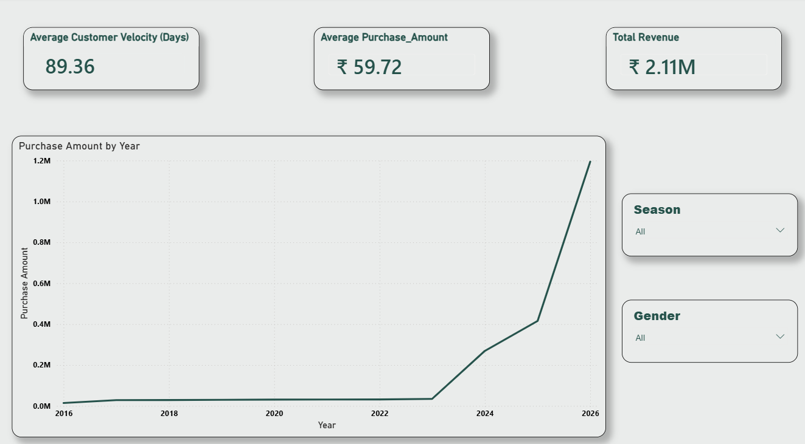
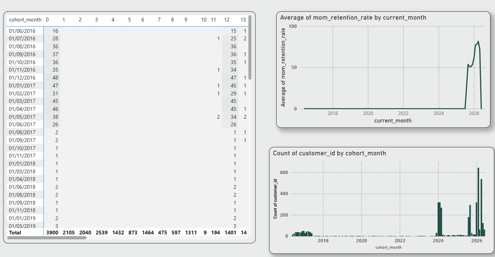

# 🚀 Customer Behavior & Retention Analytics
### End-to-End Data Analytics Project using Python, PostgreSQL & Power BI

<p align="left">


---
---

## 📌 Project Overview

This project presents an **end-to-end Customer Analytics solution** developed using **Python, PostgreSQL, and Power BI**.

The objective of this project is to analyze customer purchasing behavior, identify customers at risk of churn, measure customer retention, estimate **Customer Lifetime Value (CLV)**, and generate actionable business insights through advanced SQL analysis and interactive dashboards.

The project simulates real-world customer intelligence workflows commonly used by retail and e-commerce organizations for customer segmentation, retention strategies, and business growth.

---

## 🛠️ Tech Stack

| Technology | Purpose |
|------------|---------|
| Python | Data Cleaning & Feature Engineering |
| PostgreSQL | Data Analysis & Advanced SQL |
| Power BI | Interactive Dashboarding |
| Pandas | Data Manipulation |
| NumPy | Numerical Computation |
| Matplotlib | Data Visualization |

---

## 🎯 Business Objectives

This project aims to answer important business questions such as:

- Who are the most valuable customers based on lifetime value?
- Which customers are at risk of churn?
- What is the customer retention trend over time?
- How frequently do customers make repeat purchases?
- Which customer segments contribute the highest revenue?
- How does Customer Lifetime Value vary across customer groups?
- How do purchasing patterns evolve over time?

---

## 📊 Business Questions Solved

### 👥 Customer Analytics

✔ Top Customers by Lifetime Value (CLV)

✔ Customer Segmentation (High, Medium and Low Value)

✔ Repeat Purchase Rate

✔ Purchase Frequency Analysis

✔ Customer Revenue Contribution

---

### 🔄 Retention & Churn Analysis

✔ Churn Risk Identification

✔ Monthly Customer Retention Rate

✔ Cohort Analysis

✔ Returning Customer Trends

✔ Customer Purchase Velocity

---

### 💰 Revenue Analytics

✔ Month-over-Month Revenue Growth

✔ Running Revenue Trends

✔ Seasonal Sales Performance

✔ Revenue Distribution Across Customer Segments

✔ Customer Lifetime Value Analysis

---

## 🧠 Advanced SQL Concepts Used

### SQL Fundamentals

- SELECT
- WHERE
- GROUP BY
- HAVING
- ORDER BY
- Aggregate Functions

### Advanced SQL

- Common Table Expressions (CTEs)
- Window Functions
- LAG()
- DENSE_RANK()
- Running Totals
- CASE Statements
- KPI Calculations

### Business Analytics

- Customer Segmentation
- Churn Analysis
- Cohort Analysis
- Customer Lifetime Value (CLV)
- Retention Analytics

---

## 📈 Power BI Dashboard

The project includes an interactive **3-page Power BI Dashboard**.

### 📍 Executive Overview

- Revenue KPIs
- Total Customers
- Revenue Trends
- Interactive Filters

### 📍 Customer Analytics

- Customer Segmentation
- Revenue Distribution
- Top Customers
- Purchase Behavior

### 📍 Retention & Insights

- Cohort Analysis
- Customer Retention Trends
- Churn Analysis
- Customer Lifetime Value

---

## 📷 Dashboard Screenshots

### Executive Overview



---

### Customer Analytics



---

### Retention & Insights


---

## 💡 Key Insights

🔹 High-value customers contribute a major share of total revenue.

🔹 Repeat customers generate significantly higher Customer Lifetime Value.

🔹 Cohort analysis revealed different retention patterns among customer groups.

🔹 Churn analysis identified inactive customers, enabling targeted retention strategies.

🔹 Revenue trends highlighted seasonal purchasing behavior and customer spending patterns.

---

## 📂 Repository Structure

```text
customer-behavior-retention-analytics/

├── Dataset/
├── Python/
│   └── data_cleaning_and_analysis.ipynb

├── SQL/
│   └── behaviour_analysis.sql

├── PowerBI/
│   └── Customer_behaviour.pbix

├── Screenshots/
│   ├── Executive_Overview.png
│   ├── Customer_Analytics.png
│   └── Retention_Insights.png

└── README.md
```
## 🎯 Skills Demonstrated
* Python
* PostgreSQL
* SQL
* Power BI
* Data Cleaning
* Feature Engineering
* Customer Segmentation
* Churn Analysis
* Cohort Analysis
* Customer Lifetime Value (CLV)
* Window Functions
* Data Visualization
* Business Analytics

---

## 👨‍💻 Author

Atharv Kapoor

Aspiring Data Analyst | SQL | PostgreSQL | Python | Power BI | Business Analytics
